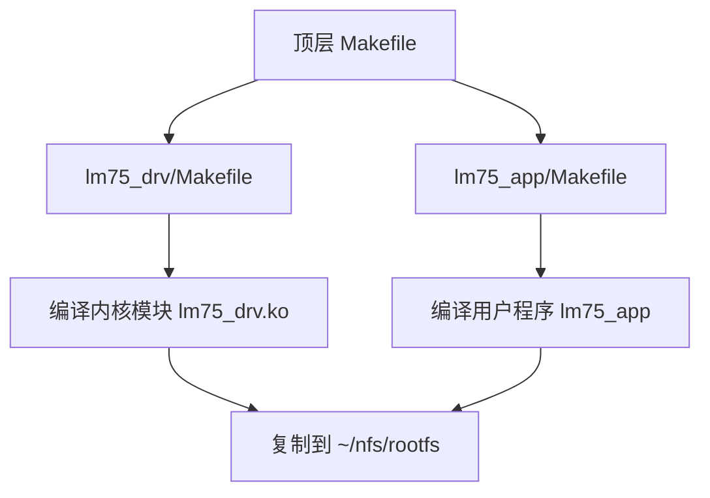
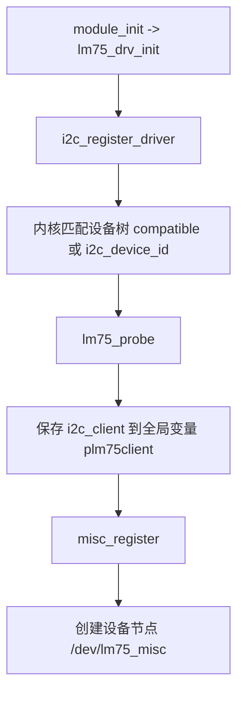
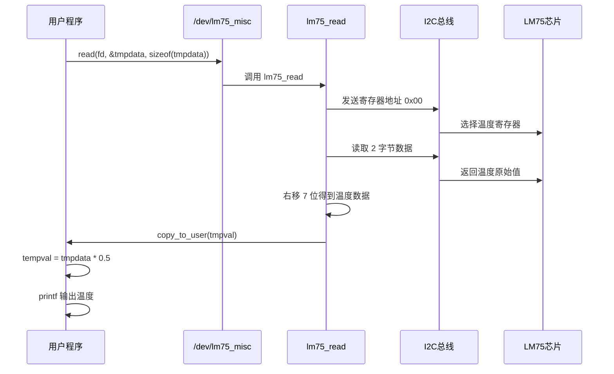

# LM75 I2C 项目代码分析

## 1. 项目整体定位

这是一个典型的 Linux I2C 设备驱动实验工程，目标是：

- 内核态实现一个 `LM75` 温度传感器驱动
- 通过 `misc` 杂项设备向用户空间暴露字符设备节点 `/dev/lm75_misc`
- 用户态程序周期性读取驱动返回的原始温度值
- 将原始值换算后打印到终端

整个工程按“驱动 + 应用”两层组织，顶层 `Makefile` 负责统一编译。

---

## 2. 目录结构分析

### 2.1 目录树

```text
13-lm75_i2c/
|-- Makefile                    # 顶层构建入口，同时编译驱动和应用
|-- lm75_drv/
|   |-- Makefile                # 内核模块编译脚本
|   |-- lm75_drv.c              # LM75 I2C 驱动主源码
|   |-- lm75_drv.ko             # 已生成的内核模块
|   |-- lm75_drv.o              # 驱动目标文件
|   |-- lm75_drv.mod.c          # 内核构建系统生成文件
|   |-- lm75_drv.mod.o          # 内核构建系统生成文件
|   |-- Module.symvers          # 内核模块符号表
|   |-- modules.order           # 模块编译顺序信息
|   |-- .lm75_drv.ko.cmd        # 编译过程记录文件
|   |-- .lm75_drv.mod.o.cmd     # 编译过程记录文件
|   |-- .lm75_drv.o.cmd         # 编译过程记录文件
|   `-- .tmp_versions/
|       `-- lm75_drv.mod        # 内核构建系统生成文件
`-- lm75_app/
    |-- Makefile                # 用户态程序编译脚本
    |-- lm75_app.c              # 用户态测试程序
    `-- lm75_app                # 已生成的应用程序
```

### 2.2 文件角色划分

- `Makefile`
  负责统一调度 `lm75_drv` 和 `lm75_app` 两个子目录的编译与清理。
- `lm75_drv/lm75_drv.c`
  项目的核心驱动代码，完成 I2C 驱动注册、设备匹配、字符设备读接口实现。
- `lm75_app/lm75_app.c`
  用户态测试程序，通过 `open + read` 读取驱动中的温度数据。
- `lm75_drv/*.ko/*.o/*.cmd`
  这些大多是编译产物，不属于手写业务逻辑。

---

## 3. 构建结构图



### 3.1 顶层 Makefile 逻辑

顶层 [Makefile](D:/桌面/课程/ARM/其他/13-lm75_i2c/Makefile#L1) 定义：

- `TARGET := lm75`
- 驱动目录：`lm75_drv`
- 应用目录：`lm75_app`
- `all` 目标先编译驱动，再编译应用
- `clean/distclean` 分别向两个子目录透传清理命令

它本身不直接参与源码编译，而是充当“总入口”。

### 3.2 驱动 Makefile 逻辑

[lm75_drv/Makefile](D:/桌面/课程/ARM/其他/13-lm75_i2c/lm75_drv/Makefile#L1) 的作用：

- 指定模块名为 `lm75_drv`
- 指定内核源码目录 `kerdir`
- 利用内核构建系统执行 `make -C $(kerdir) M=$(curdir) modules`
- 编译结束后把 `lm75_drv.ko` 拷贝到 `~/nfs/rootfs`

这说明该工程的运行环境很可能是：

- 主机交叉编译
- 通过 NFS 根文件系统把驱动和应用投放到开发板

### 3.3 应用 Makefile 逻辑

[lm75_app/Makefile](D:/桌面/课程/ARM/其他/13-lm75_i2c/lm75_app/Makefile#L1) 的作用：

- 指定可执行文件名为 `lm75_app`
- 使用交叉编译器 `arm-linux-gnueabihf-gcc`
- 把 `lm75_app.c` 编译为可执行文件
- 编译完成后拷贝到 `~/nfs/rootfs`

---

## 4. 软件结构图

### 4.1 模块关系图

```mermaid
flowchart LR
    A[用户程序 lm75_app] -->|open/read| B[/dev/lm75_misc]
    B --> C[杂项设备 miscdevice]
    C --> D[file_operations.read = lm75_read]
    D --> E[i2c_client]
    E --> F[I2C 适配器]
    F --> G[LM75 传感器]
```

### 4.2 驱动注册流程图



### 4.3 读温度流程图



---

## 5. 驱动层源码分析

驱动主文件是 [lm75_drv.c](D:/桌面/课程/ARM/其他/13-lm75_i2c/lm75_drv/lm75_drv.c#L1)。

### 5.1 全局变量

#### `static struct i2c_client *plm75client;`

位置：[lm75_drv.c:9](D:/桌面/课程/ARM/其他/13-lm75_i2c/lm75_drv/lm75_drv.c#L9)

作用：

- 保存探测成功后的 I2C 设备句柄
- 后续 `lm75_read()` 通过它访问底层 I2C 适配器

它相当于驱动和具体硬件实例之间的桥梁。

### 5.2 `lm75_read()`

位置：[lm75_drv.c:11](D:/桌面/课程/ARM/其他/13-lm75_i2c/lm75_drv/lm75_drv.c#L11)

函数原型：

```c
static ssize_t lm75_read(struct file *fp, char __user *puser, size_t n, loff_t *off)
```

作用：

- 响应用户空间的 `read()` 调用
- 从 LM75 的温度寄存器读取 2 字节原始数据
- 对原始数据做简单位处理
- 把结果拷贝给用户空间

逻辑分解：

1. 定义两个 `i2c_msg`
   - `sendmsg`：写操作，告诉芯片要访问哪一个寄存器
   - `recvmsg`：读操作，从芯片返回数据
2. 设置 `sendmsg`
   - `addr = 0x48`，表示 LM75 的 I2C 从设备地址
   - `tmpbuff[0] = 0x00`，表示选择温度寄存器
   - `len = 1`，发送 1 个字节寄存器地址
3. 调用 `master_xfer()` 发送寄存器地址
4. 设置 `recvmsg`
   - 地址仍为 `0x48`
   - `flags |= I2C_M_RD` 表示读操作
   - `len = 2` 表示读取两个字节
5. 再次调用 `master_xfer()` 接收数据
6. 组合温度数据
   - `tmpval = ((tmpbuff[0] << 8 | tmpbuff[1]) >> 7);`
   - 先拼接高低字节，再右移 7 位
7. 用 `copy_to_user()` 传给应用层

可理解为：

```text
先告诉 LM75：“我要读 0x00 温度寄存器”
再从总线上读回 2 字节
最后把处理后的温度原始值返回给用户程序
```

注意点：

- 此函数没有检查 `master_xfer()` 的返回值
- `read()` 最终固定返回 `0`，严格来说更规范的写法通常应返回实际读取字节数
- 温度换算放在应用层完成，驱动只返回原始处理值

### 5.3 `fops`

位置：[lm75_drv.c:43](D:/桌面/课程/ARM/其他/13-lm75_i2c/lm75_drv/lm75_drv.c#L43)

```c
static struct file_operations fops = {
    .owner = THIS_MODULE,
    .read = lm75_read,
};
```

作用：

- 定义字符设备的文件操作集合
- 当前只实现了 `read`
- 用户调用 `read(fd, ...)` 时，最终会进入 `lm75_read()`

### 5.4 `lm75_misc`

位置：[lm75_drv.c:48](D:/桌面/课程/ARM/其他/13-lm75_i2c/lm75_drv/lm75_drv.c#L48)

```c
static struct miscdevice lm75_misc = {
    .minor = MISC_DYNAMIC_MINOR,
    .name = "lm75_misc",
    .fops = &fops,
};
```

作用：

- 注册为杂项设备
- 名称为 `lm75_misc`
- 设备节点通常表现为 `/dev/lm75_misc`

这里选择 `miscdevice` 的好处是：

- 不需要自己申请主设备号
- 驱动代码更简洁
- 适合这种简单实验型字符设备

### 5.5 `lm75_probe()`

位置：[lm75_drv.c:54](D:/桌面/课程/ARM/其他/13-lm75_i2c/lm75_drv/lm75_drv.c#L54)

作用：

- 当内核成功匹配到 LM75 设备时调用
- 保存 `i2c_client`
- 注册杂项设备

逻辑：

1. `plm75client = pclient;`
   保存当前 I2C 设备实例
2. `misc_register(&lm75_misc);`
   向内核注册字符设备接口
3. 注册成功后，用户空间就能通过 `/dev/lm75_misc` 访问该设备

可以理解成“驱动真正开始对外提供服务”的入口函数。

### 5.6 `lm75_remove()`

位置：[lm75_drv.c:68](D:/桌面/课程/ARM/其他/13-lm75_i2c/lm75_drv/lm75_drv.c#L68)

作用：

- 当驱动卸载或设备移除时执行清理
- 注销杂项设备

逻辑：

1. 调用 `misc_deregister(&lm75_misc)`
2. 删除 `/dev/lm75_misc` 对应接口

### 5.7 `lm75_id_table`

位置：[lm75_drv.c:81](D:/桌面/课程/ARM/其他/13-lm75_i2c/lm75_drv/lm75_drv.c#L81)

作用：

- 提供传统 I2C 设备匹配表
- 设备名是 `putelm75`

如果板级信息或设备创建方式采用 `i2c_device_id` 机制，这个表会参与匹配。

### 5.8 `lm75_of_match_table`

位置：[lm75_drv.c:86](D:/桌面/课程/ARM/其他/13-lm75_i2c/lm75_drv/lm75_drv.c#L86)

作用：

- 提供设备树匹配表
- `compatible = "pute,putelm75"`

如果设备树节点中声明：

```dts
compatible = "pute,putelm75";
```

则内核会把该节点和本驱动匹配起来。

### 5.9 `lm75_driver`

位置：[lm75_drv.c:91](D:/桌面/课程/ARM/其他/13-lm75_i2c/lm75_drv/lm75_drv.c#L91)

作用：

- 定义整个 I2C 驱动对象
- 把 probe/remove/匹配表这些信息集中起来

成员含义：

- `.probe = lm75_probe`
- `.remove = lm75_remove`
- `.driver.name = "putelm75"`
- `.driver.of_match_table = lm75_of_match_table`
- `.id_table = lm75_id_table`

它是驱动注册到 I2C 子系统时的核心描述结构。

### 5.10 `lm75_drv_init()`

位置：[lm75_drv.c:102](D:/桌面/课程/ARM/其他/13-lm75_i2c/lm75_drv/lm75_drv.c#L102)

作用：

- 模块加载入口函数
- 向内核注册 `lm75_driver`

核心调用：

```c
i2c_register_driver(THIS_MODULE, &lm75_driver);
```

注册之后，内核就会尝试根据设备树或 `id_table` 去匹配实际硬件。

### 5.11 `lm75_drv_exit()`

位置：[lm75_drv.c:115](D:/桌面/课程/ARM/其他/13-lm75_i2c/lm75_drv/lm75_drv.c#L115)

作用：

- 模块卸载出口
- 调用 `i2c_del_driver(&lm75_driver)` 注销整个 I2C 驱动

### 5.12 `module_init / module_exit`

位置：

- [lm75_drv.c:122](D:/桌面/课程/ARM/其他/13-lm75_i2c/lm75_drv/lm75_drv.c#L122)
- [lm75_drv.c:123](D:/桌面/课程/ARM/其他/13-lm75_i2c/lm75_drv/lm75_drv.c#L123)

作用：

- 指定模块加载时执行 `lm75_drv_init`
- 指定模块卸载时执行 `lm75_drv_exit`

---

## 6. 应用层源码分析

应用主文件是 [lm75_app.c](D:/桌面/课程/ARM/其他/13-lm75_i2c/lm75_app/lm75_app.c#L1)。

### 6.1 `main()`

位置：[lm75_app.c:7](D:/桌面/课程/ARM/其他/13-lm75_i2c/lm75_app/lm75_app.c#L7)

这是整个用户程序唯一的函数，作用很直接：

- 打开驱动设备节点
- 不断读取温度数据
- 换算并打印

逻辑分解：

1. 定义变量
   - `fd`：设备文件描述符
   - `tmpdata`：从驱动读取到的原始温度数据
   - `tempval`：换算后的浮点温度值
2. `open("/dev/lm75_misc", O_RDWR);`
   打开驱动创建设备节点
3. 如果打开失败，则 `perror("fail to open")`
4. 进入死循环
5. 每次循环执行：
   - `read(fd, &tmpdata, sizeof(tmpdata));`
   - `tempval = tmpdata * 0.5;`
   - `printf("TEMP:%.2lf\n", tempval);`
   - `sleep(1);`

该程序本质上是一个用户态测试工具，不负责硬件控制，只负责读取和显示。

---

## 7. 核心调用链分析

### 7.1 驱动初始化调用链

```text
insmod lm75_drv.ko
    -> lm75_drv_init()
        -> i2c_register_driver()
            -> 内核匹配 I2C 设备
                -> lm75_probe()
                    -> 保存 plm75client
                    -> misc_register()
                        -> 生成 /dev/lm75_misc
```

### 7.2 用户读取调用链

```text
lm75_app main()
    -> open("/dev/lm75_misc")
    -> read(fd, &tmpdata, sizeof(tmpdata))
        -> fops.read
            -> lm75_read()
                -> master_xfer(写 0x00)
                -> master_xfer(读 2 字节)
                -> 组合温度值
                -> copy_to_user()
    -> tmpdata * 0.5
    -> printf()
```

---

## 8. 数据流分析

### 8.1 数据从硬件到终端的流向

```text
LM75芯片温度寄存器
    -> I2C总线返回2字节原始数据
    -> lm75_read() 拼接并右移7位
    -> copy_to_user() 复制到用户变量 tmpdata
    -> 应用层执行 tempval = tmpdata * 0.5
    -> 终端打印 TEMP:xx.xx
```

### 8.2 温度处理逻辑

驱动中的处理：

```c
tmpval = ((tmpbuff[0] << 8 | tmpbuff[1]) >> 7);
```

含义：

- `tmpbuff[0]` 作为高字节
- `tmpbuff[1]` 作为低字节
- 先拼接为 16 位数据
- 再右移 7 位，提取有效温度位

应用中的处理：

```c
tempval = tmpdata * 0.5;
```

说明该工程认为：

- 驱动返回的是某种“半摄氏度”为单位的原始值
- 用户态再乘以 `0.5` 得到最终温度

这类写法在教学实验中比较常见，即把底层寄存器位处理和上层显示换算拆开。

---

## 9. 函数功能汇总表

| 文件 | 函数/对象 | 作用 |
|---|---|---|
| `lm75_drv.c` | `plm75client` | 保存匹配成功后的 I2C 设备句柄 |
| `lm75_drv.c` | `lm75_read()` | 读取 LM75 温度寄存器并返回给用户空间 |
| `lm75_drv.c` | `fops` | 绑定字符设备的 `read` 操作 |
| `lm75_drv.c` | `lm75_misc` | 注册为 `/dev/lm75_misc` 杂项设备 |
| `lm75_drv.c` | `lm75_probe()` | 设备匹配成功后的初始化入口 |
| `lm75_drv.c` | `lm75_remove()` | 设备卸载时的清理函数 |
| `lm75_drv.c` | `lm75_id_table` | I2C 设备名匹配表 |
| `lm75_drv.c` | `lm75_of_match_table` | 设备树匹配表 |
| `lm75_drv.c` | `lm75_driver` | I2C 驱动总描述结构 |
| `lm75_drv.c` | `lm75_drv_init()` | 模块加载入口，注册 I2C 驱动 |
| `lm75_drv.c` | `lm75_drv_exit()` | 模块卸载出口，注销 I2C 驱动 |
| `lm75_app.c` | `main()` | 打开设备、循环读取并打印温度 |

---

## 10. 项目特点总结

这个工程的结构非常典型，适合学习 Linux 字符设备驱动和 I2C 驱动的结合方式，主要特点有：

- 采用“内核驱动 + 用户态测试程序”的双层结构
- 使用 `i2c_driver` 接入 Linux I2C 子系统
- 使用 `miscdevice` 简化字符设备注册
- 驱动只负责采集与基础位处理
- 应用层负责最终换算和显示
- 顶层 `Makefile` 统一编译，便于实验部署

---

## 11. 可以继续深入关注的点

如果后续要继续完善这个工程，可以重点看下面几个方向：

- `lm75_read()` 没有检查 `master_xfer()` 返回值，健壮性偏弱
- `read()` 返回值固定为 `0`，不符合常见字符设备接口习惯
- I2C 从地址 `0x48` 被直接写死，灵活性一般
- 没有实现 `open/release/ioctl` 等更丰富的设备接口
- 没有对负温度、异常数据、读失败场景做处理

这些问题不影响“教学演示”用途，但如果要做成更规范的驱动，建议继续补强。

---

## 12. 一句话总结

这个项目的本质是：驱动层通过 I2C 读取 LM75 温度寄存器，并用 `misc` 设备向用户空间提供统一读接口；应用层再通过 `/dev/lm75_misc` 周期性读取并打印温度值。
